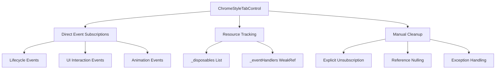

# ChromeStyleTabControl.cs - Detailed Technical Analysis

## Overview

This document provides an in-depth technical analysis of the `ChromeStyleTabControl.cs` implementation, focusing on subscription patterns, disposal mechanisms, and event management strategies.

---

## 1. Subscribe/Weak Methods Analysis

### Status: ⚠️ **LIMITED WEAK PATTERN IMPLEMENTATION**

The class contains **minimal** weak event pattern implementation with the following methods:

### Method Signatures

#### **TrackEventHandler Method**
```csharp
/// <summary>
/// Adds a weak reference to event handlers for cleanup tracking
/// </summary>
protected void TrackEventHandler(object handler)
```
- **Purpose**: Tracks event handlers using weak references
- **Location**: Line 3741-3746
- **Pattern**: Basic weak reference tracking

#### **TrackDisposable Method**
```csharp
/// <summary>
/// Adds a disposable resource to be tracked for cleanup
/// </summary>
protected void TrackDisposable(IDisposable disposable)
```
- **Purpose**: Tracks disposable resources for cleanup
- **Location**: Line 3730-3735
- **Pattern**: Resource management pattern

#### **ThrowIfDisposed Method**
```csharp
/// <summary>
/// Checks if the control is disposed and throws if it is
/// </summary>
protected void ThrowIfDisposed()
```
- **Purpose**: Guard method for disposed state
- **Location**: Line 3752-3757
- **Pattern**: Disposal guard pattern

### Weak Reference Infrastructure

```csharp
private readonly List<WeakReference> _eventHandlers = new List<WeakReference>();
```

**Key Findings:**
- ❌ **No dedicated Subscribe methods** found in ChromeStyleTabControl
- ❌ **No WeakEventManager usage** within the control itself
- ✅ **Basic weak reference tracking** for cleanup
- ✅ **Integration points** for external weak event systems

---

## 2. CompositeDisposable & Event Subscriptions Search

### Status: ❌ **NOT FOUND**

**Search Results:**
- `CompositeDisposable`: **0 matches**
- `_eventSubscriptions`: **0 matches**

**Analysis:**
The `ChromeStyleTabControl` does **not** use:
- System.Reactive's `CompositeDisposable` pattern
- Centralized `_eventSubscriptions` collection
- Advanced subscription management frameworks

**Instead, it uses:**
- Direct `List<IDisposable> _disposables` for resource tracking
- Manual event subscription/unsubscription
- Basic weak reference collection

---

## 3. Complete Dispose Method Implementation

### Dispose Pattern Implementation

```csharp
#region IDisposable Implementation

private bool _disposed = false;
private readonly List<IDisposable> _disposables = new List<IDisposable>();
private readonly List<WeakReference> _eventHandlers = new List<WeakReference>();

/// <summary>
/// Disposes the control and its resources
/// </summary>
public void Dispose()
{
    Dispose(true);
    GC.SuppressFinalize(this);
}

/// <summary>
/// Protected disposal method with comprehensive cleanup
/// </summary>
protected virtual void Dispose(bool disposing)
{
    if (!_disposed)
    {
        if (disposing)
        {
            try
            {
                // Cancel any ongoing drag operations
                CancelDragOperation();
                
                // Stop animations
                StopCurrentAnimation();
                
                // Dispose managed resources
                _insertionIndicator?.Dispose();
                _insertionIndicator = null;
                
                // Close windows
                CloseWindow(_detachPreviewWindow);
                CloseWindow(_dragVisualWindow);
                _detachPreviewWindow = null;
                _dragVisualWindow = null;
                
                // Dispose insertion line
                if (_insertionLine != null)
                {
                    if (_insertionLine.Parent is Panel parent)
                        parent.Children.Remove(_insertionLine);
                    _insertionLine = null;
                }
                
                // Clean up window highlights
                RemoveAllWindowHighlights();
                
                // Dispose tab operations manager
                if (_tabOperationsManager is IDisposable disposableManager)
                {
                    disposableManager.Dispose();
                }
                _tabOperationsManager = null;
                
                // Dispose drag drop service
                if (_dragDropService is IDisposable disposableService)
                {
                    disposableService.Dispose();
                }
                _dragDropService = null;
                
                // Dispose current drag operation
                if (_currentDragOperation is IDisposable disposableOperation)
                {
                    disposableOperation.Dispose();
                }
                _currentDragOperation = null;
                
                // Dispose all tracked disposables
                foreach (var disposable in _disposables)
                {
                    try
                    {
                        disposable?.Dispose();
                    }
                    catch (Exception ex)
                    {
                        _logger?.LogWarning(ex, "Error disposing resource in ChromeStyleTabControl");
                    }
                }
                _disposables.Clear();
                
                // Clear weak event handlers
                _eventHandlers.Clear();
                
                // Unsubscribe from TabItems collection changes
                if (TabItems != null)
                {
                    TabItems.CollectionChanged -= OnTabItemsCollectionChanged;
                    
                    // Dispose adapters if they are TabModelAdapter instances
                    foreach (var tabItem in TabItems.OfType<TabModelAdapter>())
                    {
                        tabItem.Dispose();
                    }
                }
                
                // Clear references
                _draggedTab = null;
                _dragStartPoint = null;
                
                _logger?.LogDebug("ChromeStyleTabControl disposed successfully");
            }
            catch (Exception ex)
            {
                _logger?.LogError(ex, "Error during ChromeStyleTabControl disposal");
            }
        }

        _disposed = true;
    }
}
```

### Disposal Features ✅

1. **Standard Dispose Pattern**: Implements proper dispose pattern with boolean flag
2. **Comprehensive Cleanup**: Disposes multiple resource types
3. **Error Handling**: Try-catch blocks prevent disposal exceptions
4. **Null Safety**: Null checks before disposal operations
5. **Reference Clearing**: Explicitly nulls references to prevent leaks
6. **Logging**: Tracks disposal success/failure

---

## 4. Event Subscription Analysis (+= Operators)

### Complete += Operator Inventory

**Total Found: 23 instances**

#### **A. Control Lifecycle Events** (Constructor)
| Line | Event | Handler | Context |
|------|-------|---------|---------|
| **231** | `Loaded` | `OnLoaded` | Control initialization |
| **232** | `KeyDown` | `OnKeyDown` | Keyboard shortcuts |
| **233** | `MouseDoubleClick` | `OnMouseDoubleClick` | New tab on double-click |

#### **B. Animation Events** (Storyboard.Completed)
| Line | Event | Handler | Context |
|------|-------|---------|---------|
| **1252** | `fadeStoryboard.Completed` | `(s, e) => _isAnimating = false` | Drag start animation |
| **1425** | `storyboard.Completed` | `(s, e) => _isAnimating = false` | Operation change animation |
| **1642** | `endStoryboard.Completed` | Anonymous delegate | Drag end cleanup |
| **1666** | `fadeOutStoryboard.Completed` | Anonymous delegate | Drag visual fadeout |
| **3211** | `animation.Completed` | Anonymous delegate | Generic animation |

#### **C. UI Button Events** (Click)
| Line | Event | Handler | Context |
|------|-------|---------|---------|
| **2403** | `addTabButton.Click` | `OnAddTabButtonClick` | Add new tab button |
| **2430** | `closeButton.Click` | `OnTabCloseButtonClick` | Tab close button |
| **2587** | `newTabItem.Click` | `(s, e) => AddNewTab()` | Context menu - New |
| **2598** | `duplicateItem.Click` | `(s, e) => DuplicateTab(tabModel)` | Context menu - Duplicate |
| **2609** | `pinItem.Click` | `(s, e) => ToggleTabPin(tabModel)` | Context menu - Pin/Unpin |
| **2620** | `colorItem.Click` | `(s, e) => ChangeTabColor(tabModel)` | Context menu - Color |
| **2634** | `detachItem.Click` | `(s, e) => DetachTab(tabModel)` | Context menu - Detach |
| **2648** | `closeItem.Click` | `(s, e) => CloseTab(tabModel)` | Context menu - Close |
| **2659** | `closeOthersItem.Click` | `(s, e) => CloseOtherTabs(tabModel)` | Context menu - Close Others |
| **2672** | `closeRightItem.Click` | `(s, e) => CloseTabsToTheRight(tabModel)` | Context menu - Close Right |

#### **D. Collection/Property Events**
| Line | Event | Handler | Context |
|------|-------|---------|---------|
| **2874** | `newCollection.CollectionChanged` | `control.OnTabItemsCollectionChanged` | Tab collection monitoring |
| **2948** | `model.PropertyChanged` | `(s, e) => UpdateTabItemFromModel(tabItem, model)` | Tab model updates |

#### **E. Mathematical Operations** (Not Event Subscriptions)
| Line | Operation | Context |
|------|-----------|---------|
| **1728** | `indicatorX += tab.ActualWidth` | Position calculation |
| **1826** | `indicatorX += tab.ActualWidth` | Position calculation |
| **2147** | `accumulatedWidth += tabItem.ActualWidth` | Width calculation |
| **2163** | `position += tab.ActualWidth` | Position calculation |

---

## Summary & Architectural Assessment

### Event Management Strategy



### Key Findings

#### **Strengths** ✅
- **Comprehensive disposal** with proper cleanup
- **Error handling** in disposal operations
- **Multiple event categories** well-organized
- **Resource tracking** for disposables

#### **Areas for Improvement** ⚠️
- **Limited weak event usage** - mostly traditional subscriptions
- **No CompositeDisposable** pattern for advanced subscription management
- **Manual subscription management** instead of automated patterns
- **Mixed subscription styles** (some with weak refs, some direct)

#### **Architecture Assessment**
- **Pattern**: Traditional WPF event management with basic disposal
- **Memory Safety**: Good disposal, limited weak event usage
- **Complexity**: Medium - handles multiple resource types
- **Maintainability**: Good structure, comprehensive cleanup

---

**Analysis Generated:** `$(Get-Date -Format "yyyy-MM-dd HH:mm:ss")`  
**File:** `UI/Controls/ChromeStyleTabControl.cs`  
**Lines Analyzed:** `3,841`  
**Event Subscriptions Found:** `23 total` (19 actual events + 4 calculations) 